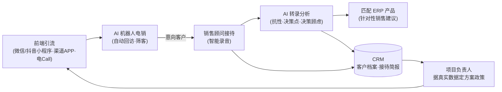

# lingxu-agent-engine

**多租户 AI Agent 引擎（Node sidecar）**：场景化会话 · 可插拔模型内核 · MCP 网关 · 双层合规 · 算力计量。

从一个真实落地的垂直行业 AI 营销系统（多租户 SaaS + 私有化交付）中抽取的引擎层，在生产环境承载
日常 AI 对话、外呼对话大脑与知识库问答。它解决的不是"怎么调一次大模型"，而是
**"怎么让大模型在一个多租户、可审计、可控成本的业务系统里长期跑"**。

> 定位：业务后端（Python/Java/Go…）旁边的一个 **Node sidecar**。业务系统管鉴权与数据，
> 引擎只做模型会话编排——两层之间用一个共享令牌（`X-Service-Token`）隔离。

## 为什么做这个：AI 落地企业的"最后一公里"

国家正在全面推进 AI 融入企业应用，政策与热度都到位了，但真到落地，多数企业卡在同一个问题：
**具体怎么落地，谁也给不出答案**。我们在房地产营销板块实打实干了一年多，把营销业务拆到底之后
发现，落地难集中在三个具体的"脏活"上——本仓库（引擎）与商业版业务系统，就是围绕这三件事长出来的。

### 痛点一：项目资料杂乱，人脑即数据库

项目资料散落各处、随时更新、人员多且流动快——新员工不清楚项目信息，老员工查资料要"找到对的人"
问，成本极高；客户想了解项目最新数据也没有统一渠道，各平台口径经常互相打架。

**解法：统一项目资料库 + 双端 AI 问答。**

- **客户端**：AI 机器人基于统一资料库即时解答，所有对外渠道口径同源；
- **员工端**：AI 助手随问随查项目资料库，新人上手不再依赖"找老员工"。

### 痛点二：接待全靠事后回忆，重点信息大量流失

每个销售的接待流程与规范因人而异；客户信息全靠销售事后回忆补录，重要信息残缺不全，
管理层拿到的数据和真实接待是两层皮。

**解法：AI 智能接待 + 自动客户画像。**

- 接待过程 AI 参与、现场录音全程智能转写；
- 接待完毕自动提炼**接待简报**：客户画像、抗性、决策点、决策顾虑，客户基础信息字段由 AI 自动填写进客户系统；
- 管理层可实时查看每一个客户的真实信息；
- AI 基于这些**真实接待数据**为项目决策提供指导与建议——而不是靠拍脑袋。

### 痛点三：引流渠道分散，线索转化断链

微信小程序、抖音小程序、渠道 APP 多端口并行，产品与项目信息要跟 ERP 保持同步；
内容要持续产出，线索进来还要靠人工逐个回访，转化链路处处断点。

**解法：多端口引流 + AI 电销自动回访。**

- 三个端口的房源产品与项目信息，全部以项目 ERP 系统为准**实时更新**；
- 抖音视频矩阵绑定项目账号**实时发布**；
- 前端引流线索 → **AI 电销自动回访**了解初步信息 → 意向客户分配给销售**真实邀约到访**。

## 一条完整的营销闭环

三个解法连起来，就是这条"线索 → 成交 → 再引流"的闭环——**闭环里的每一个 AI 对话环节，都由本引擎驱动**：



| 闭环环节 | 引擎承载的 AI 能力 | 典型形态 |
|---|---|---|
| 线索触达 | AI 外呼对话大脑：多轮沟通、口径受控、按轮计费 | 持久会话 + 业务工具 |
| 客户接待 | 案场/线上接待问答（对外，回答出口强制合规） | 临时会话 + `public` 场景 |
| 转录后分析 | 客户抗性、决策点、决策顾虑分析，结构化输出 | noTools 单发直答 |
| 销售建议 | 匹配 ERP 在售产品 + 针对性建议（数字零编造） | 场景工具 + 黄金问答回归 |
| 管理决策 | 项目助手：按真实 CRM 数据答数、生成方案素材 | 租户/角色隔离 + 工具派生 |

业务系统本身（CRM、销控、外呼管理台、ERP 对接）由你的后端与商业版承载；**本仓库是驱动
这些 AI 环节的引擎**——它不管业务数据，但让每一个 AI 环节**可审计、可控费、可换内核、可回归评测**。

## 特性

- **场景化会话**：每个业务场景（客服、问数、助手…）独立注册——系统提示 + 工具表 + 会话策略
  （持久多轮 / 临时一次性），支持 SSE 流式与整段两种返回。
- **可插拔模型内核**：内核细节收敛在 `src/pi-adapter.mjs` 一个文件（约 160 行），换 harness
  （如 DeepSeek Harness）只改它，业务代码零改动。见 `docs/adapter-contract.md`。
- **多租户隔离**：会话按租户落盘（JSONL 审计底料）、资源加载器按 (scene × tenant × project × role) 缓存、
  长活会话 LRU 上限。
- **双层合规**：对外场景回答出口先过引擎侧词库（reject/replace 两档），业务后端可再做第二层；
  词库是 JSON 配置，换口径不改代码。见 `docs/compliance.md`。
- **算力计量与配额**：每轮按企业记账（token/费用），超限前置拦截不调 LLM（fail-open 查询故障）。
- **调用韧性**：可重试错误自动重试（已吐字/已调工具即停，避免重复输出）；无状态路径重试耗尽后
  降级备用模型；首字延迟/尝试次数随响应返回。
- **MCP 网关**：从业务后端注册表拉取 MCP server 清单，工具按租户/场景/角色放行，代理调用与统计。
- **评测闭环**：黄金问答集主动评测（`scripts/eval-golden.mjs`，支持 CI 卡口 `--strict`）、
  会话 JSONL 回放审计（`scripts/replay.mjs`）、离线批量评测（`scripts/eval.mjs`）。

## 快速开始

```bash
git clone https://github.com/<you>/lingxu-agent-engine.git
cd lingxu-agent-engine
npm install
cp .env.example .env    # 至少改 AGENT_SERVICE_TOKEN
npm start               # 默认 http://127.0.0.1:8020
curl http://127.0.0.1:8020/health
```

Docker：

```bash
docker compose up -d
```

### 配置模型

模型 Key 走 [pi](https://github.com/earendil-works/pi) 的 provider 配置（不在环境变量里放 Key）：

```bash
# 方式一：pi CLI 交互配置（推荐）
npx @earendil-works/pi-coding-agent /model
# 方式二：直接写配置文件（容器部署挂载 ./pi-home:/root/.pi）
# ~/.pi/agent/auth.json 里配置 provider key，详见 pi 仓库 README
```

`AGENT_MODEL` 选 `provider/model`（默认 `deepseek/deepseek-v4-flash`；任何 OpenAI 兼容端点均可）。

### 跑一次对话（无需业务后端）

demo 场景自带 mock 工具，开箱即跑：

```bash
curl -X POST http://127.0.0.1:8020/chat \
  -H "Content-Type: application/json" \
  -H "X-Service-Token: change-me-to-a-long-random-string" \
  -d '{"scene":"faq","tenant_id":1,"project_id":1,"question":"帮我查一下订单 ORD-1001 现在什么状态？"}'
```

### 黄金问答评测（换模型/改提示词后的回归卡口）

```bash
npm run eval:golden              # 控制台表格 + 报告落盘
npm run eval:golden -- --strict  # 有 FAIL 即 exit 1（CI 用）
```

## API 一览

| 端点 | 说明 |
|---|---|
| `POST /chat` | 场景对话。`{scene, tenant_id, project_id, question, session_key?, stream?, trace_id?}`；`stream:true` 返回 SSE（`tool`/`delta`/`done` 事件） |
| `POST /internal/v1/llm/single` | noTools 单发直答（system+user 一次补全，模型只能吐文本，无工具触达面） |
| `GET /admin/models` / `POST /admin/model` | 可用模型清单 / 主模型热切（无需重启） |
| `GET /internal/v1/mcp/tools` / `POST /internal/v1/mcp/call` | MCP 网关：场景工具清单 / 工具调用代理 |
| `GET /health` / `GET /sessions` | 健康检查（模型/会话/网关统计）/ 持久会话落盘清单（审计） |

除 `/health` 外均需请求头 `X-Service-Token`（与业务后端共享，防直连绕过）。

## 写一个自己的场景

三步（详见 `docs/scene-guide.md`）：

1. 在 `src/scenes/` 新建 `my-scene.mjs`：导出 `makeMyScene(ctx)`，返回 `{systemPrompt, tools}`；
2. 在 `src/server.mjs` 的 `SCENES` 注册：`persist`（多轮 or 一次性）与 `public`（是否过合规出口）；
3. 在 `scripts/golden-qa.json` 加几条黄金问答——改提示词/换模型后 `npm run eval:golden` 回归。

工具执行两种形态：直接内置（mock/本地逻辑），或调业务后端的内部只读 API（模板见
`src/scenes/demo.mjs` 内注释）。

## 文档

- [架构总览](docs/architecture.md) —— 分层、数据流、为什么这样设计
- [内核适配契约](docs/adapter-contract.md) —— 换 harness（pi → 其它）只改一个文件的完整清单
- [场景开发指南](docs/scene-guide.md) —— system prompt / 工具 / 合规 / 评测的写法与坑
- [合规双层设计](docs/compliance.md) —— 词库驱动的出口过滤，reject/replace 两档
- [黄金问答评测](scripts/README-eval-golden.md) —— 断言规则与 CI 接入

## 生产经验（这个引擎真实验过的场）

- **首字延迟可观测**：`timing.ttft_ms / queue_ms / attempts` 随每个响应返回——排障时区分
  "排队慢"还是"模型慢"还是"在重试"；
- **自述句清洗**：模型爱写"我先查一下数据"，工具过程前端已可视化时正文自述是噪音——
  内置中英文双层正则清洗（`cleanNarration`），带防误伤兜底；
- **持久会话按业务日切 key**：工具口径修复后，旧会话会复述修复前的假数——按日切让问数
  始终拿到当日上下文；
- **对外场景禁流式**：delta 流不经词级合规过滤，对外保持整段+出口过滤，流式仅内部场景启用；
- **配额前置拦截**：超限直接回提示不调 LLM——省钱且可追责。

## Roadmap

- [ ] DeepSeek Harness（Cordis）内核适配器（`pi-adapter` 的第二个实现，契约已就绪）
- [ ] 飞书 / 钉钉 / 企业微信 连接器（免登身份映射 + 事件长连接）
- [ ] Trajectory 回放视图（基于会话 JSONL）
- [ ] 英文文档

## 联系我们

- **微信**：`caichaojie1987`（业务合作 / 私有化部署 / AI 落地咨询，加微信请备注来意）
- Issue / PR：直接在本仓库提

## License

[Apache-2.0](LICENSE)。商业版（多项目工作台、真实外呼线路对接、企业级审计增强）为闭源产品，
见 NOTICE——本仓库不包含也不影响其许可。
